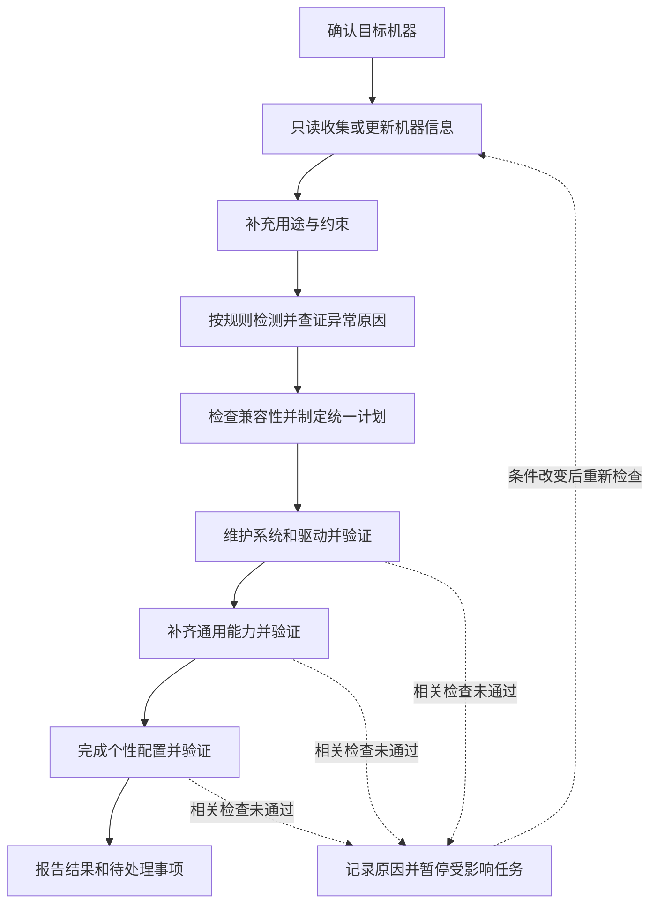

# 已确定的工作流

状态：会话中已确定的流程。本文描述完整产品应有的行为；目前已实现 [只读检查原型](prototype.md)，安装、修复和设备功能验证尚未实现。字段、路径和交互细节分别在其他设计草案中讨论。

项目的兼容性、权限、恢复和验证约束统一维护在 [AGENTS.md](../AGENTS.md)。不同 Agent 工具共用本文，不各自维护一套流程。

## 阶段顺序

每次启动都从确认目标机器和更新机器信息开始。用途与约束要尽早参与规划，个性化变更在基础维护与通用补充之后执行。

取得信息后先按规则检测，必要时补充采集并分析异常原因，再形成维护计划。采集、检测、诊断和修复分别记录；首版独立规则已实现，范围见 [检测规则](detection-rules.md)，后续接入与能力改进约定见 [Agent 接入与能力改进](agent-integration-and-evolution.md)。

图中顺序表示执行优先级。进入下一阶段前，检查系统基础条件和该任务所依赖的功能。可选功能的问题可以保留待处理，不受影响的任务继续；未通过的必要检查不能被跳过或标为完成。

| 阶段 | 要解决的问题 | 进入后续阶段的条件 |
| --- | --- | --- |
| 确认目标与更新信息 | 这次操作的是哪台机器，它现在是什么状态，哪些信息无法取得 | 能确定目标；记录采集范围、结果和未知项。无法确定目标时仅继续不依赖目标身份的工作 |
| 补充用途与约束 | 机器的用途、指定版本、必须保留的功能和已有授权是什么 | 已知需求足够制定当前任务的计划；只询问影响方案且无法自动判断的信息 |
| 状态检测与原因分析 | 哪些条件通过、失败或未知，异常原因有哪些证据 | 缺失信息明确列出；诊断有证据引用，关键原因未确认的操作保留待处理 |
| 制定统一计划 | 基础维护、通用能力和个性需求是否互相冲突 | 具体列出直接与连带变更、依据、执行顺序、验证和恢复方法；关键依据不足的任务保留待处理 |
| 系统与驱动维护 | 基础组件是否可用，必要的修复或更新是什么，设备能否完成所需功能 | 系统基础条件及后续任务依赖的功能验证通过；待重启、待人工验证项目继续保留 |
| 通用能力补充 | 适用于本机、用户已选择的日常能力有哪些缺口 | 所选能力及受影响的已有功能验证通过，或明确说明不适用、未选择、失败和待处理项 |
| 个性配置 | 用户的具体用途还需要哪些软件和配置 | 目标功能及受影响的已有功能验证通过；不能只凭安装命令成功判断完成 |
| 报告与续接 | 完成了什么，还有什么不能确认，下次如何继续 | 保存实况、计划、执行与验证记录、恢复资料及未完成原因 |

系统维护根据问题、必要的安全更新和兼容性依据制定变更，不等于每次启动全面升级。首次运行建立档案；后续运行复查实际状态，只处理仍有必要的项目。

系统稳定性有明确的检查范围。结果应表述为“本次所需检查通过”，并列出范围、时间和未确认项。硬件功能无法自动检查时，保留待验证状态。

## 变化贯穿所有阶段

变化可能来自 Agent、用户、系统自动更新或硬件调整。无法确定来源时记录来源未知，不把所有外部变化归因于用户。

发现变化后按以下顺序处理：

1. 保存新的实际观察及采集结果。检测失败同样记录，旧状态另存历史。
2. 比较前后状态，区分已确认的变化、暂未检测到的对象和无法比较的范围。
3. 找出受影响的检查、目标与尚未执行的操作，使相关旧结论不再用于放行任务。
4. 重新核对兼容性与当前需求。影响范围无法确定时，先补充探测或依据。
5. 更新计划及其版本，重新检查授权是否覆盖新增影响。
6. 执行可继续的任务，验证目标与受影响功能，再更新记录。

| 变化 | 处理原则 |
| --- | --- |
| 软件安装、更新或移除 | 检查相关目标、依赖和功能；可用且符合要求时接受现状 |
| 配置被修改 | 读取现有内容及生效情况，保留外部修改，重新判断后续操作和恢复是否可行 |
| 系统、内核或驱动变化 | 重新核对相关支持关系，区分当前运行环境与计划重启后的环境 |
| 硬件新增或更换 | 重新识别设备、用途和驱动关系，验证所需功能，按需调整计划 |
| 设备没有被检测到 | 先记录本次未检测到；核实临时断开、检测失败或实际移除，不能直接清理驱动 |
| 执行中条件变化 | 暂停尚未执行且受影响的步骤；正在写入系统的操作按工具支持的安全方式结束，再核对实况 |

发现变化本身不要求恢复旧状态。已有目标与现状发生冲突且无法判断用户意图时，询问具体冲突，不擅自回退版本或覆盖配置。

## 运行边界

检查时点包括启动、恢复任务、关键操作前及每组操作后。Agent 退出后不实时监测变化，下次启动再发现并处理；后台监听尚不在本次已定流程中。

预览允许生成本工具的计划和报告，但不安装目标系统依赖、不修改目标配置、不更新目标系统的软件包索引。缺失或陈旧的元数据会使相关计划保留待核实状态。

失败、等待重启、等待用户验证或关键条件不足时，暂停依赖该结果的任务。没有新依据时不重复同一个失败方案。结束一次运行时可以有未完成项，必须说明原因及继续条件。

软件、配置和驱动变更的分组、权限、备份、恢复与验证均遵循 [AGENTS.md](../AGENTS.md)。已经满足并验证目标的项目跳过写入；过去的记录不能代替本次核对。

## 细节文档

- [机器信息与稳定性检查](inventory-and-health.md)：采集范围、未知项和检查通过条件。
- [数据保存与任务执行](storage-and-execution.md)：记录关系、计划版本、任务状态和恢复。
- [用户交互](user-interaction.md)：对话、计划展示、授权和待定选择。
